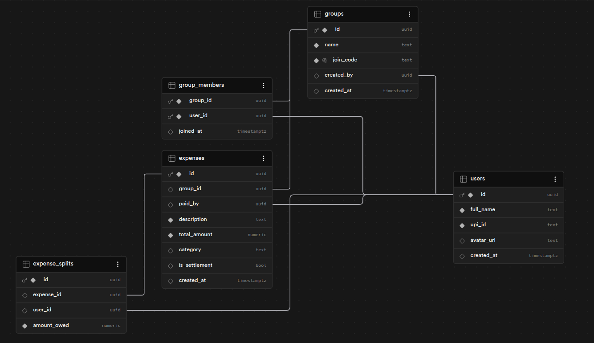

# Database Documentation

This document describes the database schema, workflow, and relational logic for the DevFusion application.

## 1. The Complete Workflow

Let’s walk through exactly what happens between Flutter and your database when Abhinav, Arnav, Shammas, and Jyotirya use the app. This is how the relational design works.

### Step 1: Users Sign Up (Populating the `users` table)
* **Action:** The four users download the app and enter their name and UPI ID.
* **Database Event:** Flutter inserts four independent rows into the `users` table.
  * **Avatar Generation:** The app uses the DiceBear API (`https://api.dicebear.com/7.x/avataaars/svg?seed={name}`) to generate a unique, permanent avatar for each user.
    * If Abhinav signs up, Flutter saves: `.../svg?seed=Abhinav` (generating an avatar with glasses).
    * If Arnav signs up, Flutter saves: `.../svg?seed=Arnav` (generating an avatar with a hat).
* **State:** Right now, they are just four independent users. The database does not yet know they are friends.

### Step 2: Abhinav Creates the Group
* **Action:** Abhinav clicks "Create Group", types "Hackathon Trip", and gets the code `HACK99`.
  > [!NOTE]
  > This code is generated in Flutter. There is a very low probability of duplicate codes. If a conflict occurs, the database will reject the entry, prompting the app to generate a new code.
* **Database Event 1:** Flutter creates one row in the `groups` table and assigns a new `group_id` (e.g., `group_123`).
* **Database Event 2:** To record group membership, Flutter inserts rows into the junction table `group_members`:
  * `group_123` + `user_Abhinav`
  * `group_123` + `user_Arnav`
  * *(...and so on for all four users)*
* **Relational Magic:** When Member 1 (Frontend) wants to show the group screen, they query the database: *"Give me all users inside `group_123`."* The database uses the junction table to instantly return all four users.

### Step 3: The Pizza Expense (Parent and Child Rows)
* **Action:** Abhinav pays ₹1000 for Domino's.
* **Database Event 1 (The Parent):** Flutter creates one row in the `expenses` table:
  * `group_id`: `group_123`
  * `paid_by`: `user_Abhinav`
  * `total_amount`: 1000
  * The database assigns this expense a unique ID: `expense_pizza_1`.
* **Database Event 2 (The Children):** To split the cost, Flutter immediately creates four rows in the `expense_splits` table, linking each split to `expense_pizza_1`:
  * Row 1: Abhinav owes ₹250
  * Row 2: Arnav owes ₹250
  * Row 3: Shammas owes ₹400
  * Row 4: Jyotirya owes ₹100
* **Relational Magic:** Because of the `FOREIGN KEY` relation (with cascade delete), deleting the Pizza expense automatically deletes its four splits, ensuring data integrity.

### Step 4: The Settlement
* **Action:** Arnav checks the app, sees he owes Abhinav ₹250, and pays him via UPI.
* **Database Event:** Flutter logs a balancing expense to settle the debt:
  * **Parent:** One row in `expenses` (Paid by: `user_Arnav`, Amount: ₹250, Category: `settlement`, ID: `expense_settle_1`).
  * **Child:** One row in `expense_splits` (Owed by: `user_Abhinav`, Amount: ₹250).
* **Relational Magic:** When Member 3 runs his algorithm, he queries the database: *"Give me all `expense_splits` for `group_123`."* The database returns both the original pizza splits and the settlement split. The Dart logic aggregates these values, bringing Arnav's net debt to ₹0.

## 2. Summary of DB Architecture

The database is structured using a **Hub and Spoke** model:
* **The Hub:** The `groups` table acts as the central entity.
* **The Spokes:** The `users`, `expenses`, and `expense_splits` tables connect to the hub.

Because major entities reference a `group_id`, fetching complete group data for the Flutter app is highly efficient and straightforward.
